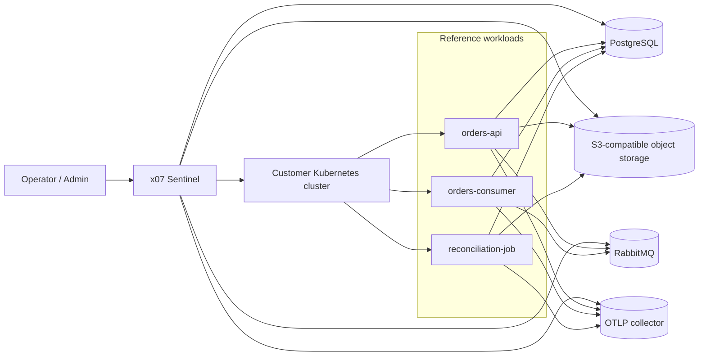

# x07 Sentinel reference stack

A public, canonical reference repo for deploying a small but complete backend system to **x07 Sentinel** on **customer-managed Kubernetes**.

This repository proves the enterprise story with one backend domain and three service shapes:

- **`orders-api`** — HTTP API service
- **`orders-consumer`** — event consumer
- **`reconciliation-job`** — scheduled job

It also ships:

- shared contract artifacts in **`apps/order-domain/`**
- Terraform for **AWS** and **GCP**
- Sentinel payloads and scripts for:
  - target registration
  - secret upload
  - binding creation
  - workload packing
  - CAS upload
  - release submit / approval
  - smoke verification
  - rollback
- step-by-step tutorials from **onboarding → deploy → verify → rollback**

## What this repo proves

- x07 services compile to native runtime images.
- x07 Platform packages workloads into Sentinel-compatible packs.
- Sentinel deploys and rolls back on your Kubernetes cluster.
- The example uses:
  - PostgreSQL
  - AMQP / RabbitMQ
  - S3-compatible object storage
  - hosted secrets
  - OTLP telemetry
- The same application topology can be reproduced on **AWS** and **GCP**.

## Current scope

- `make local-smoke` exercises the full system locally (no cloud spend).
- AWS/GCP Terraform + Sentinel scripts are included for the real deployment path, but require cloud credentials and Sentinel access to run end-to-end.

## Repo layout

```text
apps/
  order-domain/         Shared contracts and report schemas
  orders-api/           HTTP service
  orders-consumer/      Event consumer
  reconciliation-job/   Scheduled job

infra/
  terraform/aws/minimal/
  terraform/gcp/minimal/
  kubernetes/bootstrap/

sentinel/
  payloads/
  scripts/
  examples/

docs/
  00-overview.md
  01-onboarding.md
  02-architecture.md
  03-local-smoke.md
  10-aws-tutorial.md
  11-gcp-tutorial.md
  20-sentinel-onboarding.md
  21-register-target.md
  22-create-bindings.md
  23-build-pack-release.md
  24-verify-and-rollback.md
  25-audit-and-incidents.md
  26-verification.md
  30-claim-coverage.md
```

## Quick start paths

### AWS path

1. Read [docs/01-onboarding.md](docs/01-onboarding.md)
2. Create infra with [docs/10-aws-tutorial.md](docs/10-aws-tutorial.md)
3. Register the cluster and bindings in Sentinel with [docs/20-sentinel-onboarding.md](docs/20-sentinel-onboarding.md)
4. Build, pack, submit, approve, verify, and roll back with:
   - [docs/23-build-pack-release.md](docs/23-build-pack-release.md)
   - [docs/24-verify-and-rollback.md](docs/24-verify-and-rollback.md)

### GCP path

1. Read [docs/01-onboarding.md](docs/01-onboarding.md)
2. Create infra with [docs/11-gcp-tutorial.md](docs/11-gcp-tutorial.md)
3. Register the cluster and bindings in Sentinel with [docs/20-sentinel-onboarding.md](docs/20-sentinel-onboarding.md)
4. Build, pack, submit, approve, verify, and roll back with:
   - [docs/23-build-pack-release.md](docs/23-build-pack-release.md)
   - [docs/24-verify-and-rollback.md](docs/24-verify-and-rollback.md)

## Architecture



## Tutorial stance

The tutorials mirror the real Sentinel experience:

- onboarding and sign-in
- org / project / environment setup
- target registration
- bindings and secret upload
- release submit and approval
- verify and rollback
- audit trail review

The API path is shown wherever possible so the repo stays reproducible.

## Screenshots

Add screenshots under `docs/screenshots/` as you validate the stack on a real Sentinel environment.

See [docs/screenshots/README.md](docs/screenshots/README.md).

## License

Apache 2.0
