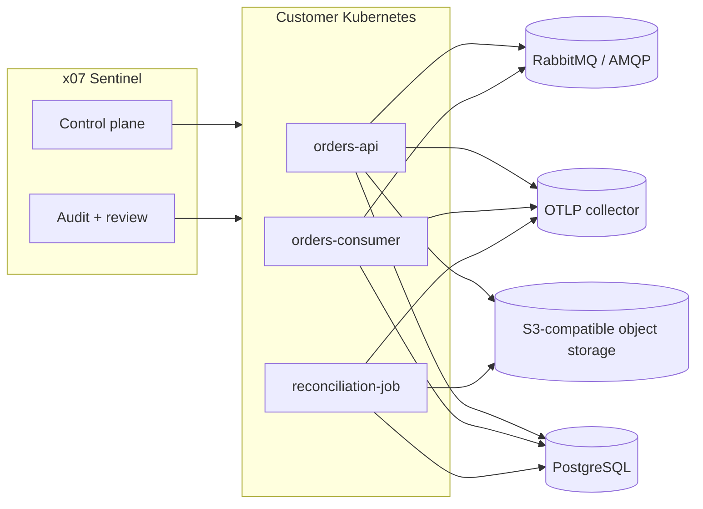

# Architecture

```mermaid
flowchart LR
  subgraph sentinel[x07 Sentinel]
    cp[Control plane]
    audit[Audit + review]
  end

  subgraph cluster[Customer Kubernetes]
    api[orders-api]
    consumer[orders-consumer]
    job[reconciliation-job]
  end

  db[(PostgreSQL)]
  broker[(RabbitMQ / AMQP)]
  obj[(S3-compatible object storage)]
  otlp[(OTLP collector)]

  cp --> cluster
  audit --> cluster

  api --> db
  api --> obj
  api --> broker
  api --> otlp

  consumer --> db
  consumer --> broker
  consumer --> otlp

  job --> db
  job --> obj
  job --> otlp
```

Only the infrastructure layer changes between AWS and GCP. The Sentinel-side flow stays the same.
